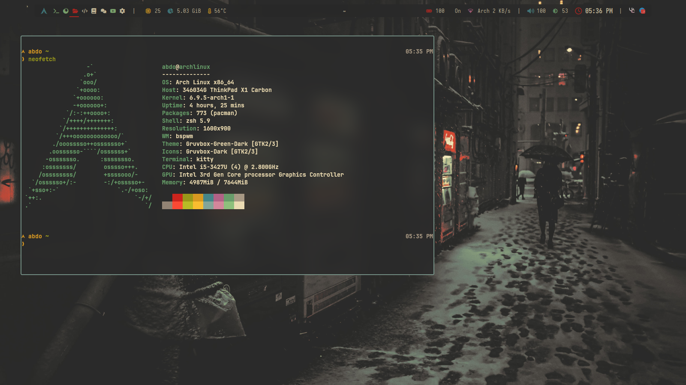

# BSPWM Rice


## Table of Contents

- [Introduction](#introduction)
- [Dependencies](#dependencies)
- [Project Structure](#project-structure)
- [Installation](#installation)
  - [Manual Installation](#manual-installation)
  - [Automated Installation](#automated-installation)
- [Troubleshooting](#troubleshooting)
  - [Touchpad Issue](#touchpad-issue)

## Introduction

This repository contains configuration files and setup instructions for 
customizing BSPWM on Arch Linux. It includes configurations for various components such as Polybar, Rofi, and more.

## Dependencies

- **OS:** [Arch Linux](https://archlinux.org/)
- **Terminal:** [kitty](https://sw.kovidgoyal.net/kitty/)
- **Shell:** [zsh](https://ohmyz.sh/)
- **Window Manager:** [bspwm](https://github.com/baskerville/bspwm)
- **Compositor:** [picom](https://github.com/yshui/picom)
- **Font:** [JetBrains Mono](https://www.jetbrains.com/lp/mono/)
- **Dock:** [Polybar](https://github.com/polybar/polybar)
- **Application Launcher:** [Rofi](https://github.com/davatorium/rofi)

## Project Structure 

```bash
.
├── alacritty (important use stow with it)
├── bspwm (important use stow with it)
├── dunst (important use stow with it)
├── helix (important use stow with it)
├── img
│   └── bsprice.png
├── kitty (important use stow with it)
├── picom (important use stow with it)
├── polybar (important use stow with it)
├── README.md
├── starship (important use stow with it)
├── step
├── sxhkd (important use stow with it)
├── wallpapers
│   ├── bersek.png
│   ├── bleach.png
│   ├── Madara.png
│   ├── pain.png
│   ├── wallhaven-2e2xyx.png
│   ├── wp11058332-gruvbox-wallpapers.png
│   └── wp11058333-gruvbox-wallpapers.png
├── Xorg
│   └── 30-touchpad.conf
├── yazi (important use stow with it)
└── zsh (important use stow with it)
```

## Installation

You have two options for installing this BSPWM rice setup:

### Manual Installation

1. **Clone this repository:**
   ```bash
   git clone https://github.com/Abdogouhmad/dotfile_bspwm.git ~/
   ```

2. **Symlink configuration files using `stow`:**
   ```bash
   cd dotfile_bspwm
   stow bspwm polybar helix kitty ...
   ```
   Replace `bspwm`, `polybar`, `rofi`, etc., with the directories containing their respective configuration files.

### Automated Installation

1. *(Provide details of your automated installation script if available.)*

## Troubleshooting

### Touchpad Issue

If you encounter issues with the Lenovo X1 Carbon touchpad not working, you can try the following fix:

```bash
sudo cp Xorg/30-touchpad.conf /etc/X11/xorg.conf.d/
```

This step ensures that the touchpad configuration is correctly applied and may resolve the issue.
